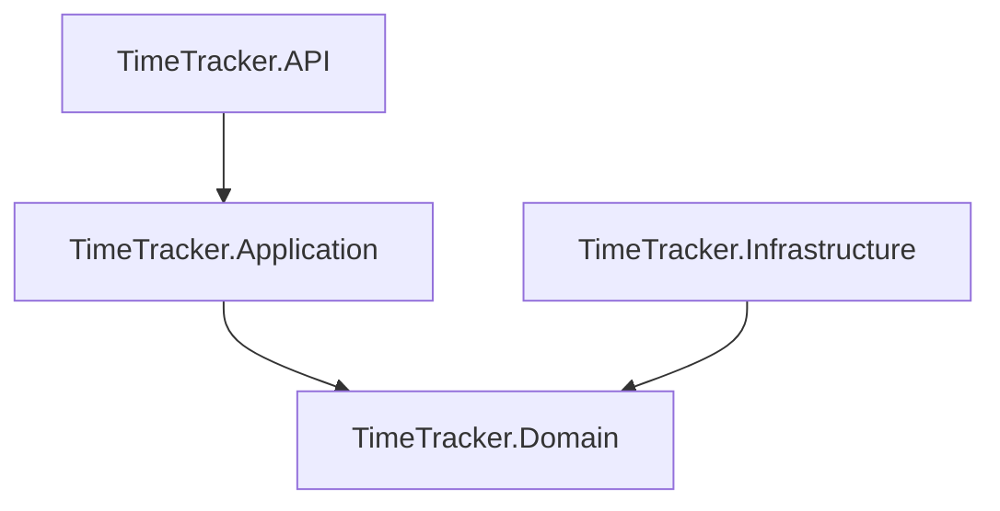

# Development

- [Development](#development)
  - [Architecture and Project Design](#architecture-and-project-design)
  - [Step 1: Defining Domain Models](#step-1-defining-domain-models)
    - [In `TimeTracker.Domain`:](#in-timetrackerdomain)
  - [Step 2: Setting Up Infrastructure](#step-2-setting-up-infrastructure)
    - [In `TimeTracker.Infrastructure`:](#in-timetrackerinfrastructure)
  - [Step 3: Implementing Application Logic](#step-3-implementing-application-logic)
    - [In `TimeTracker.Application`:](#in-timetrackerapplication)
  - [Step 4: Setting Up API](#step-4-setting-up-api)
    - [In `TimeTracker.API`:](#in-timetrackerapi)
  - [Step 5: Integration Testing](#step-5-integration-testing)
  - [Step 6: Docker and Deployment](#step-6-docker-and-deployment)
    - [Docker:](#docker)
    - [Deployment:](#deployment)
  - [Step 7: Documentation](#step-7-documentation)
  - [Solution \& Project Setup Commands](#solution--project-setup-commands)

## Architecture and Project Design

## Step 1: Defining Domain Models
### In `TimeTracker.Domain`:
- Define entities and aggregates (e.g., `TimeRecord`, `User`).
- Develop business rules and logic for these entities.

## Step 2: Setting Up Infrastructure
### In `TimeTracker.Infrastructure`:
- Implement the repository pattern for data access.
- Configure the Entity Framework context for database interaction.

## Step 3: Implementing Application Logic
### In `TimeTracker.Application`:
- Create services for performing business operations.
- Define DTOs (Data Transfer Objects).

## Step 4: Setting Up API
### In `TimeTracker.API`:
- Create controllers for handling HTTP requests.
- Configure routing, request validation, and response formatting.

## Step 5: Integration Testing
- Write integration tests.
- Ensure the API's correct functioning and interaction with the database.

## Step 6: Docker and Deployment
### Docker:
- Create a `Dockerfile` for the API.
- Use `docker-compose.yml` if necessary.

### Deployment:
- Deploy the application on the chosen platform.

## Step 7: Documentation
- Document your API (e.g., using Swagger).

## Solution & Project Setup Commands
These commands outline the steps to set up a .NET solution with a domain-driven design, including creating the necessary projects and adding dependencies among 
- Command to create a new solution
- Command to add existing projects to the solution
- Command to add references to other projects or packages

[Setup Commands page](solution--project-setup-commands/solution--project-setup-commands.md)

[Go back](../../README.md#development)