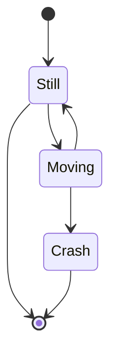
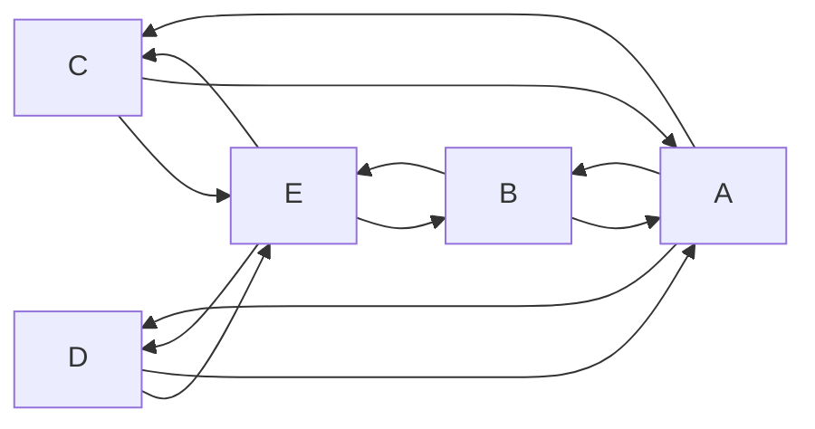
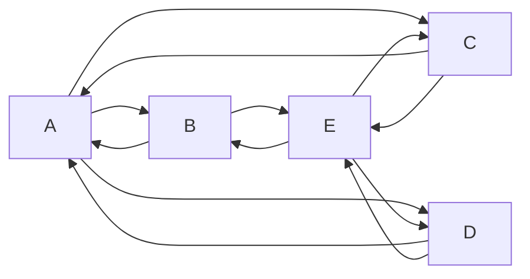
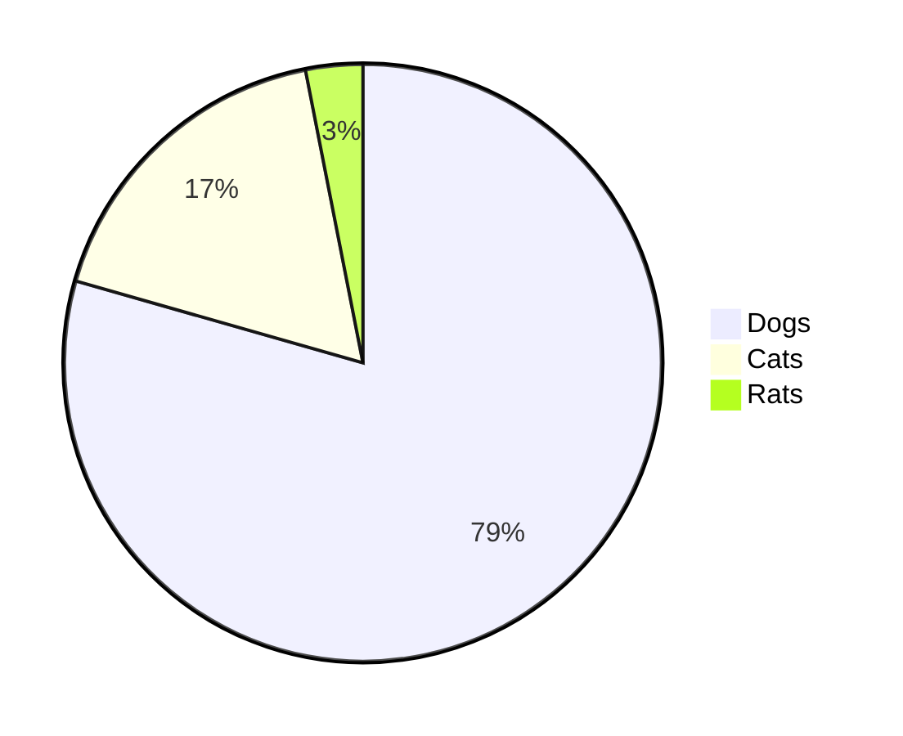

- [Jupyter Notebook](#jupyter-notebook)
- [Line (like a header 2)](#line-like-a-header-2)
- [List (Header 2)](#list-header-2)

**Markdown+Math v2.7.4** allows to use Visual Studio Code as a markdown editor capable of typesetting and rendering TeX math.K, In fact it now reuses the built in markdown viewer. KaTeX works inside as a fast math renderer.

$$[ \text{Point 2} = P + [\sin(\phi), \cos(\phi), 0] ]$$

$$E=mc^2$$

$$x_{1,2} = \frac{-b \pm \sqrt{b^2-4ac}}{2b}.$$

[VsixHub](https://www.vsixhub.com/) is an online repository for Visual Studio Code extensions, offering a wide range of VSIX files for enhancing coding environments in various functionalities.

## [Jupyter Notebook](jupyterNotebook/jupyterNotebook.md)

Everything that is in this repository is nothing more than a draft for one technology or another.
Attention! Don't take it seriously and don't judge harshly

***

[Link to another markDown file](markDownContent/test.markdown "Hover over")

[About Mermaid](https://mermaid-js.github.io/mermaid/#/?id=about-mermaid)



***



***



***



***
Detailed information about how to use the PlantUML [Test file](markDownContent/test.md)

[Markdown - Tutorials](https://www.w3schools.io/file/markdown-introduction/ "Markdown - Tutorials")

Documentation

[Ignore or escape Markdown syntax](https://docs.microsoft.com/en-us/azure/devops/project/wiki/markdown-guidance?view=azure-devops#ignore-or-escape-markdown-syntax-to-enter-specific-or-literal-characters)

Line (like a header 2)
---
* item:

```cs
using System.IO;

namespace CsvReaderApp
{
    class Program
    {
        static void Main()
        {
            var path = @"../../../data/data.csv";
            var lines = File.ReadAllLines(path);
            var cells = new CsvReader(new StringConverter()).Read<double>(lines);
        }
    }
}
```

```json
{
  "firstName": "John",
  "lastName": "Smith",
  "isAlive": true,
  "age": 27,
  "address": {
    "streetAddress": "21 2nd Street",
    "city": "New York",
    "state": "NY",
    "postalCode": "10021-3100"
  },
  "phoneNumbers": [
    {
      "type": "home",
      "number": "212 555-1234"
    },
    {
      "type": "office",
      "number": "646 555-4567"
    }
  ],
  "children": [],
  "spouse": null
}
```


## List (Header 2)
* Item 1
* Item 2

Example:


|00|01|02|
|-:|-:|-:|
|00010|000011|00000000012|

<p>
  
</p>

|00|01|02|
|:-|-:|:-:|
|0000010|000000011|0000000000012|

<p>
  
</p> 


Regular **Markdown** here.

<!--
@startuml firstDiagram

Alice -> Bob: Hello
Bob -> Alice: Hi!
	
@enduml
-->


    @startuml
    Foo --> Bar
    @enduml
<div hidden>
```
@startuml secontDiagram
    Foo --> Bar
@enduml
```
</div>

```
:clock1:
`:copyright:`
`:registered:`
`:tm:`
`:x:`
`:heavy_exclamation_mark:`
`:bangbang:`
`:interrobang:`
`:o:`
`:heavy_multiplication_x:`
`:heavy_plus_sign:`
`:heavy_minus_sign:`
`:heavy_division_sign:`
`:white_flower:`
`:100:`
`:heavy_check_mark:`
`:ballot_box_with_check:`
`:radio_button:`
`:link:`
`:curly_loop:`
`:wavy_dash:`
`:part_alternation_mark:`
`:trident:`
`:black_square:`
`:white_square:`
`:white_check_mark:`
`:black_square_button:`
`:white_square_button:`
`:black_circle:`
`:white_circle:`
`:red_circle:`
`:large_blue_circle:`
`:large_blue_diamond:`
`:large_orange_diamond:`
`:small_blue_diamond:`
`:small_orange_diamond:`
`:small_red_triangle:`
`:small_red_triangle_down:`
`:ship:`
```