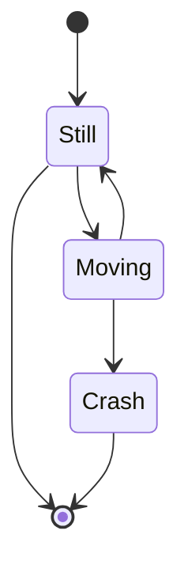
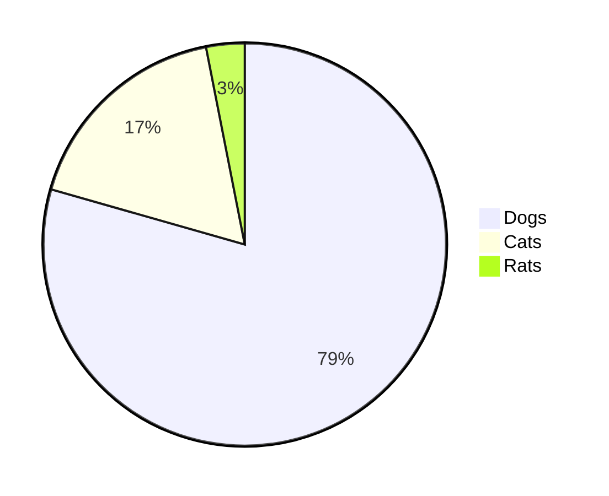

# This is a study project (Header 1)
<<<<<<< HEAD
***

[google search](https://google.com)

just a text
=======

Everything that is in this repository is nothing more than a draft for one technology or another.
Attention! Don't take it seriously and don't judge harshly

***

[Link to another markDown file](markDownContent/test.markdown "Hover over")

[About Mermaid](https://mermaid-js.github.io/mermaid/#/?id=about-mermaid)





Detailed information about how to use the PlantUML [Test file](markDownContent/test.md)

[Markdown - Tutorials](https://www.w3schools.io/file/markdown-introduction/ "Markdown - Tutorials")

Documentation

[Ignore or escape Markdown syntax](https://docs.microsoft.com/en-us/azure/devops/project/wiki/markdown-guidance?view=azure-devops#ignore-or-escape-markdown-syntax-to-enter-specific-or-literal-characters)
>>>>>>> 5d5ef6d50073b891bbf4575e62c07e04246c4d07

Line (like a header 2)
---
* item:

<<<<<<< HEAD
```c#
=======
```cs
>>>>>>> 5d5ef6d50073b891bbf4575e62c07e04246c4d07
using System.IO;

namespace CsvReaderApp
{
    class Program
    {
        static void Main()
        {
            var path = @"../../../data/data.csv";
            var lines = File.ReadAllLines(path);
            var cells = new CsvReader(new StringConverter()).Read<double>(lines);
        }
    }
}
```

```json
{
  "firstName": "John",
  "lastName": "Smith",
  "isAlive": true,
  "age": 27,
  "address": {
    "streetAddress": "21 2nd Street",
    "city": "New York",
    "state": "NY",
    "postalCode": "10021-3100"
  },
  "phoneNumbers": [
    {
      "type": "home",
      "number": "212 555-1234"
    },
    {
      "type": "office",
      "number": "646 555-4567"
    }
  ],
  "children": [],
  "spouse": null
}
```


## List (Header 2)
* Item 1
* Item 2

<<<<<<< HEAD
Example:


|00|01|02|
|-:|-:|-:|
|00010|000011|00000000012|

<p>
  
=======

|00|01|02|
|:-|-:|:-:|
|0000010|000000011|0000000000012|

<p>
  
>>>>>>> 5d5ef6d50073b891bbf4575e62c07e04246c4d07
</p> 


Regular **Markdown** here.

<!--
@startuml firstDiagram

Alice -> Bob: Hello
Bob -> Alice: Hi!
	
@enduml
-->


<<<<<<< HEAD
<!--
    @startuml
    Foo --> Bar
    @enduml
-->
=======
<div hidden>
```
@startuml secontDiagram
    Foo --> Bar
@enduml
```
</div>
>>>>>>> 5d5ef6d50073b891bbf4575e62c07e04246c4d07
